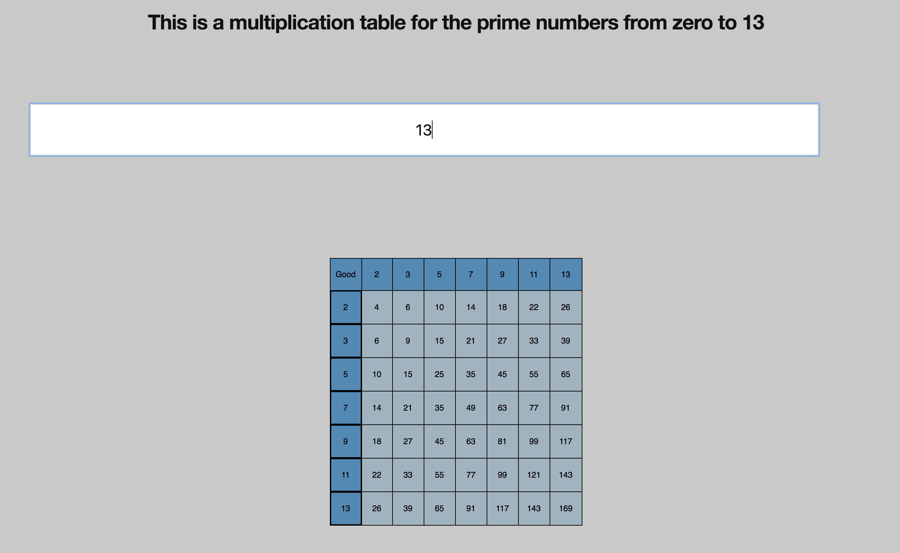

## How to run

- Clone this repo into your local machine.
```
git clone https://github.com/HuascarMC/prime-multiplication-table
```
- Go inside your prime-multiplication-table directory.
```
cd prime-multiplication-table
```
- Install all the packages required.
```
npm i
```
- Run all the tests and ensure they're all passing.
```
npm test
```
- Open another terminal tab and run the server.
```
npm start
```
- If your browser doesn't open autmatically, go to:
```
http://localhost:3000
```
- The app will display an input box, you should be able to get a prime multiplication table by typing a number 0 < 500
and pressing enter.



## Functionality

- The app uses an independent primable tool that takes care of the prime numbers and increasing a prime array given a value.

- Each component of the app has been tested using enzyme's shallow for unit tests and renderer for snapshot tests, it keeps the app in shape for future expansion.

- Primable tool has been tested using mocha.

- It displays a table with all the prime numbers request by the user.

- It handles bad input, doesn't crash when using letter, symbols.

- Output renders well, numbers are displayed inside a cell within a row that is generated by an independent class.

# Things to improve/currently working on.

- Add more tests and improve existing test suites. Some of the tests require mocking. For example,
when adding 'e.preventDefault' to prevent the input/form from reloading the page. Some tests complained. One possible solution would be using 'spy' to see if this callback would be called.

- Only takes input for numbers from zero to 500. Any higher than that and takes too long to render the table. This could be improved writing a better algorithm in the primable tool or the 'appendRows' algorithm.

- The 'append rows' method is slightly long and could be split in more methods to make the codebase more SOLID/loose coupled.

- The TableRowComponent adds CSS tags but doesn't do it in a clear way, it could be more dynamic as well. For example, when adding tags to the first prime number in an array, it could be ```<th></th>``` for headers instead of ```<td></td>```.

- When running the test suites, there's currently a warning explaining that each child in an array or iterator should have a key. It doesn't cause issues when running the app but it could be problematic when trying to access the DOM.
